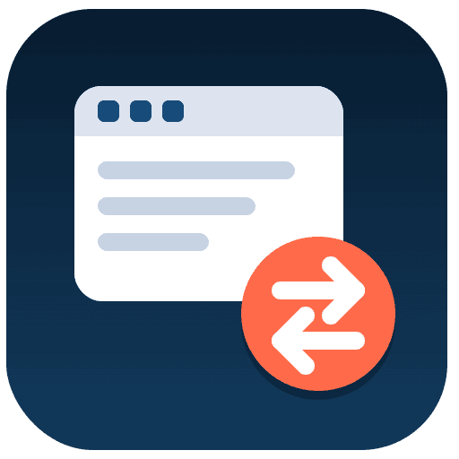

# FG Editor Switcher

A Joomla editor plugin that lets you switch which editor (TinyMCE, CodeMirror,
None, JCE, ...) is used for editing fields, directly from a dropdown placed
next to the standard edit-screen toolbar (Article/Image/Pagebreak/Read
More/...) - without going through Global Configuration.

## Features

- Dropdown selector styled to match the admin template's own toolbar buttons
  (colour, height, alignment) instead of a plain, mismatched `<select>`.
- Works with any installed/enabled editor plugin, including third-party ones
  (e.g. JCE) that use a different toolbar markup than Joomla's core editors.
- Carries unsaved content over to the newly selected editor when switching,
  so nothing is lost - with an automatic fallback to a confirmation prompt
  if the handover can't be completed (very large content, browser storage
  unavailable, etc).
- Supports multiple editor fields on the same admin page, including fields
  added later (repeatable subforms, AJAX-loaded forms).
- Remembers the chosen editor via a cookie.
- Optional debug mode that logs the active editor and cookie value to the
  browser console.
- Native Joomla 6 architecture: PSR-4, dependency injection via
  `services/provider.php`, WebAssetManager for JS/CSS.

## Requirements

- Joomla 4.2, 5.x or 6.x
- PHP 7.4+

## Installation

1. Download the latest release ZIP from the
   [Releases](https://github.com/ferino75/plg_fgeditorswitcher/releases) page.
2. Install it via Joomla's Extensions → Manage → Install.
3. Enable the plugin under **Plugins → FG Editor Switcher**, and set your
   preferred default editor and other options.
4. In **System → Global Configuration → Site → Default Editor**, select
   **FG Editor Switcher** as the site's default editor.

## Updates

This plugin ships with a Joomla update server pointing at this repository's
`updates.xml`, so new releases are offered automatically through Joomla's
Extension Manager once installed.

## License

[GNU General Public License v2.0](LICENSE)
